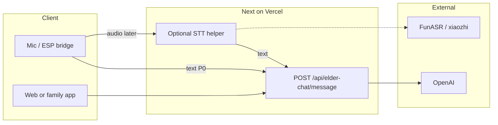

# Anyu — Voice + OpenAI + STT Implementation Spec (Handoff)

**Audience:** Anyu workspace implementer (Next.js 15 App Router on Vercel).  
**Goal:** Ship a **minimal vertical slice**: utterance-complete STT (no partial streaming ASR), server-side OpenAI for reply generation, Wisewave-style safety and env patterns. Optional later: fine-tuned model, full product APIs from product MD/PDF.

**Product-aligned HTTP names** (match Implementation Spec / Elder Agent / 子女端 docs where applicable):

| Product doc concept | HTTP (this spec) | Next.js handler |
|---------------------|------------------|-----------------|
| Elder chat turn | `POST /api/elder-chat/message` | `app/api/elder-chat/message/route.ts` |
| Conversation handle | `POST /api/elder-chat/session` | `app/api/elder-chat/session/route.ts` |
| Risk engine | `POST /api/risk/evaluate` | `app/api/risk/evaluate/route.ts` (P1) |
| Consent | `GET /api/consent`, `PATCH /api/consent`, `POST /api/consent/revoke` | `app/api/consent/route.ts` + `revoke/route.ts` (P1) |
| Family dashboard (子女端) | `GET /api/family/dashboard` etc. | Out of P0; see §12 |

**Reference repo (patterns only, different URL prefix):** `easy-openai-chatkit-app` — Wisewave Option B uses `POST /api/chat/turn` and `POST /api/chat/session`. **Reuse the pattern; rename paths to Anyu’s contract above.**

---

## 1. Scope and non-goals

**In scope (P0)**

- Next 15 **Route Handlers** under `app/api/**/route.ts` (never expose `OPENAI_API_KEY` to the browser).
- **`POST /api/elder-chat/message`:** one turn — accept **text** (already transcribed) *or* optional **audio** in a later iteration.
- **Utterance-complete STT:** one segment in → one transcript out (FunASR local / xiaozhi `LOCAL` or `NON_STREAM`; not xiaozhi `STREAM` ASR unless product changes).
- **OpenAI:** Chat Completions (or org-approved chat API) with **versioned system prompt**; **LLM reply may stream** (recommended for voice) even though STT is non-streaming.
- Env-based model name; structured errors; request id in logs.

**Out of scope for P0**

- Full `GET /api/family/dashboard`, notifications, emotion-trend charts (子女端 bundle).
- HC-OS reflection extraction, Wisewave drift linter.

---

## 2. Architecture (high level)



**Recommended split**

- **A — Text-in (P0):** Bridge already runs FunASR → `POST /api/elder-chat/message` with JSON `message` (string). Anyu only calls OpenAI.
- **B — Audio-in on Vercel (later):** multipart to a dedicated route or same handler behind feature flag → forward to **self-hosted** STT; avoid heavy FunASR inside default serverless bundle.

Default: **A**.

---

## 3. Environment variables

| Variable | Required | Notes |
|----------|----------|--------|
| `OPENAI_API_KEY` | Yes | Server only; never `NEXT_PUBLIC_`. |
| `ANYU_OPENAI_CHAT_MODEL` | Recommended | Org-approved chat model. |
| `ANYU_SYSTEM_PROMPT` or file path | Recommended | Pair with `ANYU_PROMPT_VERSION`. |
| `DATABASE_URL` | Optional until persistence | Required once `session` + history are stored. |
| STT provider keys | Only if cloud STT on Vercel | See §6. |

Vercel: Project → Settings → Environment Variables. Local: `.env.local`. Do not commit secrets.

---

## 4. API contract (implement in this order)

### 4.1 `POST /api/elder-chat/session` (optional P0 if stateless first)

**Purpose:** Create a server-side conversation id for multi-turn elder chat.

Headers: `Authorization: Bearer <JWT>` when auth exists.  
Body: `{}` or `{ "elder_profile_id": "optional" }` if product schema requires it later.

Response:

```json
{ "session_id": "<uuid>" }
```

Wisewave analogue: `POST /api/chat/session` — same semantics, **Anyu path name only**.

---

### 4.2 `POST /api/elder-chat/message` (P0 core)

**Purpose:** One user turn → one assistant reply (maps to product “Elder Emotional Communication Agent” chat line).

Headers: `Content-Type: application/json`; `Authorization: Bearer <JWT>` when auth exists.

Body:

```json
{
  "session_id": "optional-uuid",
  "message": "本轮用户文本（已由 bridge STT 产出或键盘输入）",
  "lang": "zh"
}
```

Success — **JSON (simplest first):**

```json
{
  "assistant_message": "...",
  "conversation_id": "<uuid>",
  "meta": {
    "model": "...",
    "prompt_version": "...",
    "timestamp": "2026-04-26T12:00:00.000Z"
  }
}
```

**Streaming variant:** same URL with e.g. `Accept: text/event-stream` or body flag `"stream": true` — return SSE/NDJSON for **LLM tokens only**; STT remains utterance-complete upstream.

**Implemented (this repo):** `Content-Type: text/event-stream; charset=utf-8`. Each SSE `data:` line is JSON: `{"type":"meta",...}`（含 `conversation_id`、`turn_id`、`model` 等）→ 若干 `{"type":"delta","text":"..."}` → `{"type":"done"}`；流建立前失败仍返回 **JSON** `502`/`503`（与 JSON 模式一致）。

Errors: `400` invalid body; `401` auth; `404` unknown `session_id`; `502` upstream with safe `assistant_message` fallback where appropriate.

---

### 4.3 `POST /api/risk/evaluate` (P1 stub)

**Purpose:** Structured risk signal from **text** (and optional metadata), separate from chat route so rules/models can change independently.

Body (minimal stub):

```json
{ "text": "...", "session_id": "optional", "context": "optional" }
```

Response (example shape — tighten to product MD):

```json
{ "level": "L0", "signals": [], "version": "risk-v0" }
```

Implement as thin handler + `lib/anyu/risk/evaluate.ts` pure function.

---

### 4.4 Consent API (P1, Implementation Spec)

Align names with product doc:

- `GET /api/consent` — current consent flags for authenticated user/device.
- `PATCH /api/consent` — partial update.
- `POST /api/consent/revoke` — revoke.

Persist with Prisma when schema exists (`ConsentSetting`, etc.); until then return `501` or static JSON **only in dev** with a big comment.

---

## 5. OpenAI call (Wisewave-like server pattern)

- **URL:** `https://api.openai.com/v1/chat/completions` (or org base URL).
- **Messages:** `system` (Anyu prompt) + history from DB or single-turn for P0.
- **Streaming:** optional `stream: true` + `ReadableStream` response for TTS pipelines.
- **Logging:** no full prompts in production logs; include `turn_id` / request id.

**Code reference (Wisewave path names):**  
`easy-openai-chatkit-app/app/api/chat/turn/route.ts` — copy **structure** (fetch, errors, normalize), **not** HC-OS business logic.

---

## 6. STT (utterance-complete only)

**Requirement:** 说完一句再出整句 — no live partial ASR in product v1.

| Mode | Flow |
|------|------|
| **Bridge default** | xiaozhi FunASR `fun_local` → text → `POST /api/elder-chat/message`. |
| **Cloud one-shot** | e.g. OpenAI `v1/audio/transcriptions` per utterance WAV. |
| **xiaozhi STREAM ASR** | Not required for v1. |

Internal helper when audio is supported:

`transcribeUtterance(bytes, mime) -> { text, language?, durationMs? }`  
`ANYU_STT_PROVIDER=bridge|openai_whisper|...`

---

## 7. Fine-tuning policy

1. P0: base model + versioned system prompt; no FT.
2. Build eval harness (50–200 turns + red-team) before FT.
3. FT only if eval proves gain; env `ANYU_OPENAI_FT_MODEL` + **fallback** base model.
4. Do not fix STT problems with LLM FT.

---

## 8. Safety and compliance (minimal)

- System boundaries: no medical/legal certainty; crisis resources if product requires.
- Logs: redact secrets; avoid storing raw audio unless spec + retention policy say so.
- **Consent:** Implementation Spec expects real gating — use **middleware** + server session when this slice ships, not checkbox-only on one page.

---

## 9. Implementation checklist

1. `app/api/elder-chat/message/route.ts` — text in, **risk 先判**（L3/L4 不调 LLM），OpenAI out, env model, errors, SSE。
2. Vercel env + smoke test（README：JSON + UTF-8 说明）.
3. SSE streaming on same route（`Accept: text/event-stream` 或 `"stream": true`）— **已接**；事件：`meta` / `delta` / `done`.
4. `app/api/elder-chat/session/route.ts` — **已接**（无 DB 时仅签发 UUID；Prisma 持久化后续再接）.
5. `app/api/risk/evaluate/route.ts` + `lib/anyu/risk/evaluate.ts` + **`message` 内串联** — **已接**（`lib/anyu/risk/blocked-reply.ts`）.
6. `app/api/consent/*` — **GET/PATCH `/api/consent`、`POST /api/consent/revoke` 已接**（无 DB 时 **501** `NOT_IMPLEMENTED`）；Prisma + 真门禁后续再接。
7. **`lib/anyu/stt.ts`** + **`POST /api/elder-chat/transcribe`** — utterance-complete；`ANYU_STT_PROVIDER=bridge|openai_whisper|off`；Whisper 需密钥；默认 bridge（**501** 提示走文本 `message`）。
8. **`middleware.ts`** + **`POST /api/cn/disclaimer-ack`** — `/cn/*`（除 disclaimer / ethics / safety）需 HttpOnly **`anyu_disclaimer_ack`**；本地可 **`ANYU_SKIP_DISCLAIMER_MIDDLEWARE=1`**。

---

## 10. Suggested file layout (Anyu repo)

```
app/api/elder-chat/message/route.ts
app/api/elder-chat/transcribe/route.ts
app/api/elder-chat/session/route.ts
app/api/risk/evaluate/route.ts
app/api/consent/route.ts
app/api/consent/revoke/route.ts
app/api/cn/disclaimer-ack/route.ts
middleware.ts
lib/anyu/openai-chat.ts
lib/anyu/prompts.ts
lib/anyu/stt.ts
lib/anyu/site-disclaimer.ts
lib/anyu/risk/evaluate.ts
lib/anyu/risk/blocked-reply.ts
```

---

## 11. 子女端 / family (out of P0)

Product routes such as `/app/family/...` and `GET /api/family/dashboard`, `emotion-trend`, `notifications` stay **separate workstream** after elder chat + consent foundations exist. Do not block P0 on them.

---

## 12. Copy to Anyu workspace

Source file in Wisewave stack repo:

`docs/ANYU_Voice_OpenAI_STT_Implementation_Spec.md`

Copy into Anyu repo `docs/` unchanged in naming so **product MD and this spec share the same path strings**.

---

*Adjust model IDs and JWT claims with CTO / org policy.*
